# SomaPace — Architecture Document

## System Overview

SomaPace is a smart, self-paced learning web application built for Kenyan students following the Competency-Based Curriculum (CBC). Students upload school materials (PDFs, DOCX, images), and the system uses AI (Google Gemini 1.5 Pro) to generate structured lessons, quizzes, flashcards, and practice questions. Content is delivered as a Progressive Web App (PWA) with full offline support, audio narration via Google Cloud TTS, and spaced repetition for retention. Payments are handled through M-Pesa (Safaricom Daraja API).

### Key Design Principles

- **Offline-First**: PWA with service worker caching for low-bandwidth environments
- **Mobile-First**: Designed for smartphones (85%+ of Kenyan internet access)
- **AI-Powered**: Automated content generation from raw school materials
- **CBC-Aligned**: Content structured per Kenyan curriculum standards
- **Low-Cost**: Infrastructure designed to serve 10,000+ students at ~$0.02/student/month

---

## Architecture Diagram

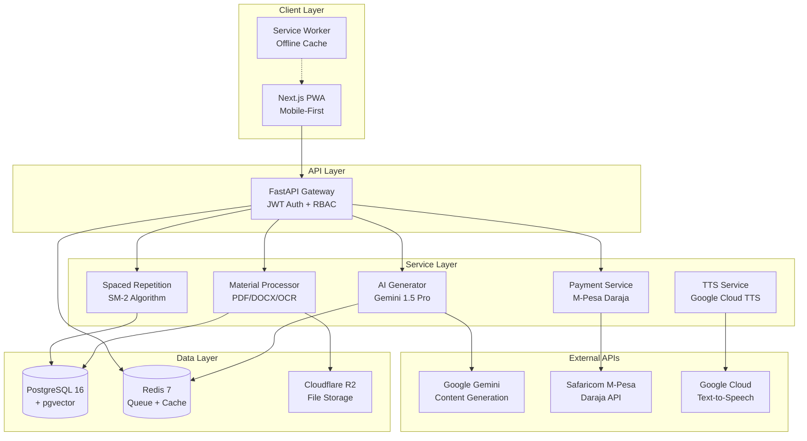

---

## Data Flow

### 1. Material Upload Pipeline

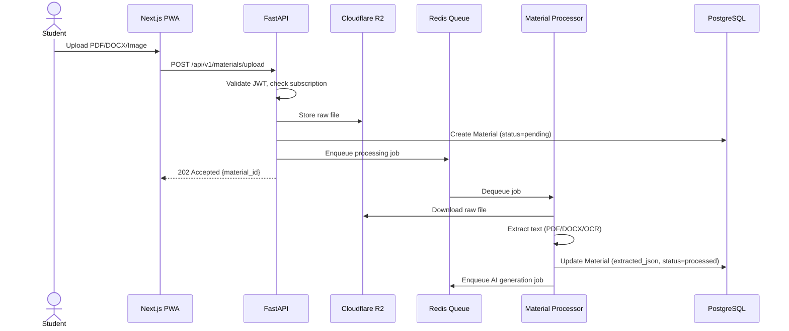

### 2. AI Lesson Generation Pipeline

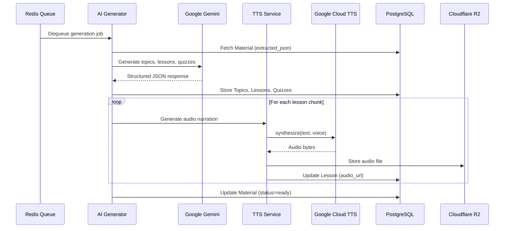

### 3. Quiz Flow

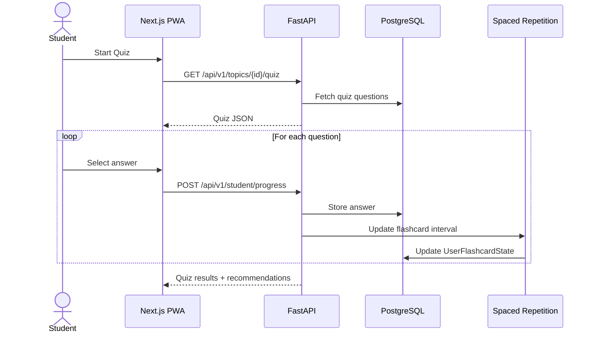

### 4. M-Pesa Payment Flow

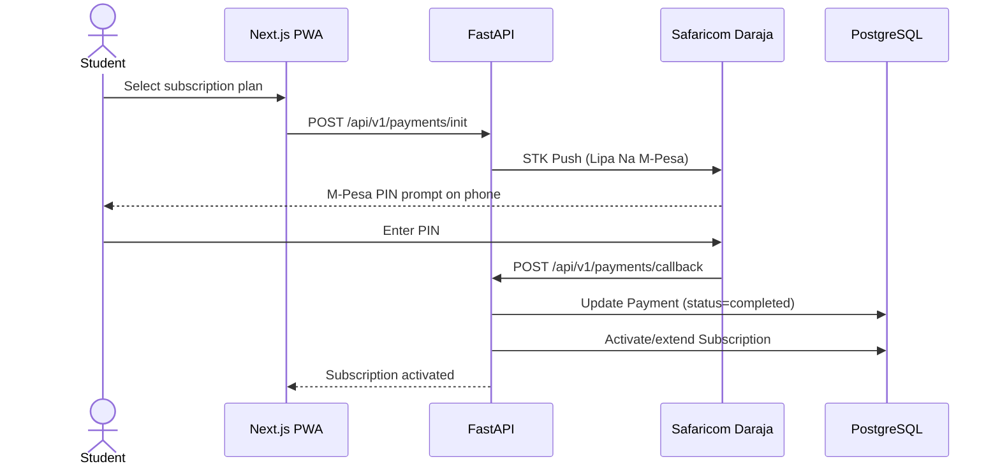

---

## Database ER Diagram

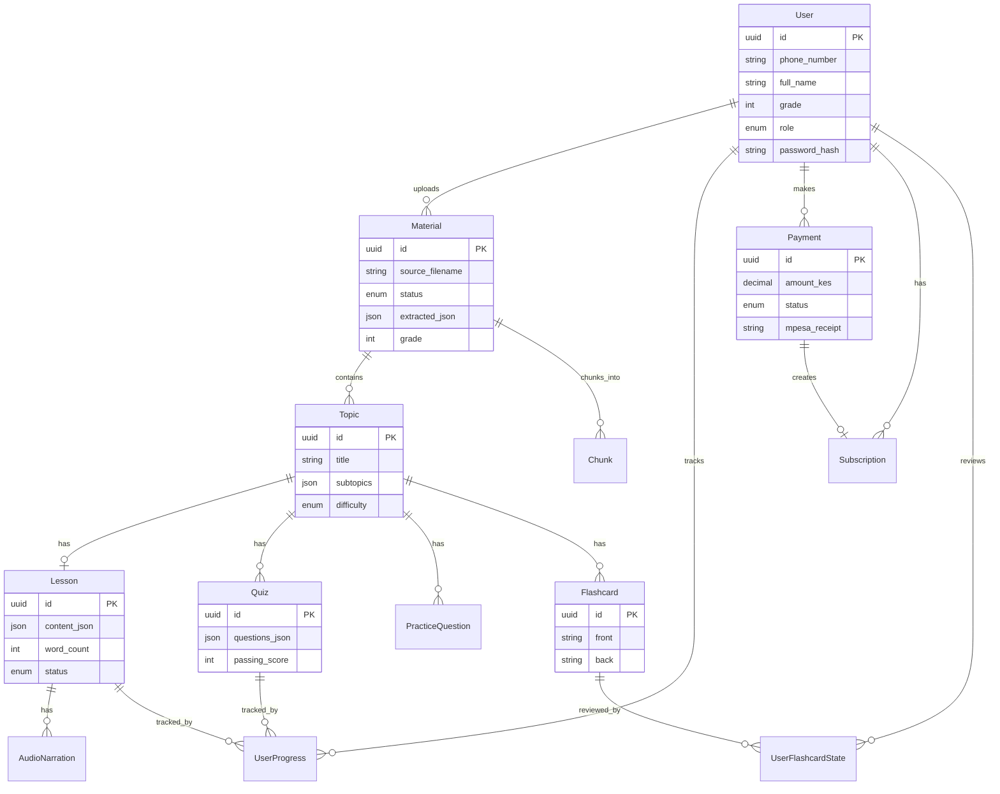

### Full Schema Reference

#### users
| Column | Type | Notes |
|--------|------|-------|
| id | UUID | PK, default gen_random_uuid() |
| phone_number | VARCHAR(15) | Unique, E.164 format |
| full_name | VARCHAR(255) | Required |
| grade | INTEGER | 1-12, Kenyan grade level |
| role | ENUM | student, teacher, admin |
| password_hash | VARCHAR(255) | bcrypt hash |
| created_at | TIMESTAMPTZ | Default now() |
| updated_at | TIMESTAMPTZ | Default now() |

#### materials
| Column | Type | Notes |
|--------|------|-------|
| id | UUID | PK |
| user_id | UUID | FK -> users.id |
| source_filename | VARCHAR(500) | Original filename |
| file_url | TEXT | R2 storage URL |
| file_type | ENUM | pdf, docx, image |
| extracted_json | JSONB | Parsed content |
| grade | INTEGER | CBC grade level |
| subject | VARCHAR(100) | e.g., Mathematics |
| status | ENUM | pending, processing, processed, failed, ready |
| created_at | TIMESTAMPTZ | |

#### topics
| Column | Type | Notes |
|--------|------|-------|
| id | UUID | PK |
| material_id | UUID | FK -> materials.id |
| title | VARCHAR(500) | Topic name |
| subtopics | JSONB | Array of subtopic strings |
| difficulty | ENUM | easy, medium, hard |
| order_index | INTEGER | Display order |

#### lessons
| Column | Type | Notes |
|--------|------|-------|
| id | UUID | PK |
| topic_id | UUID | FK -> topics.id |
| content_json | JSONB | Structured lesson content |
| word_count | INTEGER | For TTS cost estimation |
| audio_url | TEXT | R2 URL for audio narration |
| status | ENUM | generating, ready, failed |

#### quizzes
| Column | Type | Notes |
|--------|------|-------|
| id | UUID | PK |
| topic_id | UUID | FK -> topics.id |
| questions_json | JSONB | Array of question objects |
| passing_score | INTEGER | Percentage (default 70) |

#### flashcards
| Column | Type | Notes |
|--------|------|-------|
| id | UUID | PK |
| topic_id | UUID | FK -> topics.id |
| front | TEXT | Question/term |
| back | TEXT | Answer/definition |

#### practice_questions
| Column | Type | Notes |
|--------|------|-------|
| id | UUID | PK |
| topic_id | UUID | FK -> topics.id |
| question_text | TEXT | |
| solution_json | JSONB | Step-by-step solution |
| difficulty | ENUM | |

#### user_progress
| Column | Type | Notes |
|--------|------|-------|
| id | UUID | PK |
| user_id | UUID | FK -> users.id |
| topic_id | UUID | FK -> topics.id |
| lesson_id | UUID | FK -> lessons.id (nullable) |
| quiz_id | UUID | FK -> quizzes.id (nullable) |
| score | INTEGER | Percentage |
| completed | BOOLEAN | |
| created_at | TIMESTAMPTZ | |

#### user_flashcard_state
| Column | Type | Notes |
|--------|------|-------|
| id | UUID | PK |
| user_id | UUID | FK -> users.id |
| flashcard_id | UUID | FK -> flashcards.id |
| ease_factor | FLOAT | SM-2 parameter (default 2.5) |
| interval_days | INTEGER | Days until next review |
| repetitions | INTEGER | Successful reviews |
| next_review | TIMESTAMPTZ | Next scheduled review |

#### payments
| Column | Type | Notes |
|--------|------|-------|
| id | UUID | PK |
| user_id | UUID | FK -> users.id |
| amount_kes | DECIMAL(10,2) | Amount in KES |
| mpesa_receipt | VARCHAR(100) | M-Pesa transaction ID |
| status | ENUM | pending, completed, failed |
| created_at | TIMESTAMPTZ | |

#### subscriptions
| Column | Type | Notes |
|--------|------|-------|
| id | UUID | PK |
| user_id | UUID | FK -> users.id |
| payment_id | UUID | FK -> payments.id |
| plan | ENUM | monthly, yearly |
| starts_at | TIMESTAMPTZ | |
| expires_at | TIMESTAMPTZ | |
| active | BOOLEAN | |

#### audio_narrations
| Column | Type | Notes |
|--------|------|-------|
| id | UUID | PK |
| lesson_id | UUID | FK -> lessons.id |
| voice | VARCHAR(50) | TTS voice name |
| audio_url | TEXT | R2 URL |
| duration_seconds | FLOAT | |

#### chunks
| Column | Type | Notes |
|--------|------|-------|
| id | UUID | PK |
| material_id | UUID | FK -> materials.id |
| chunk_index | INTEGER | Order within material |
| content | TEXT | Extracted text chunk |
| embedding | VECTOR(768) | pgvector embedding |

---

## Authentication & Authorization

### JWT-Based Auth Flow

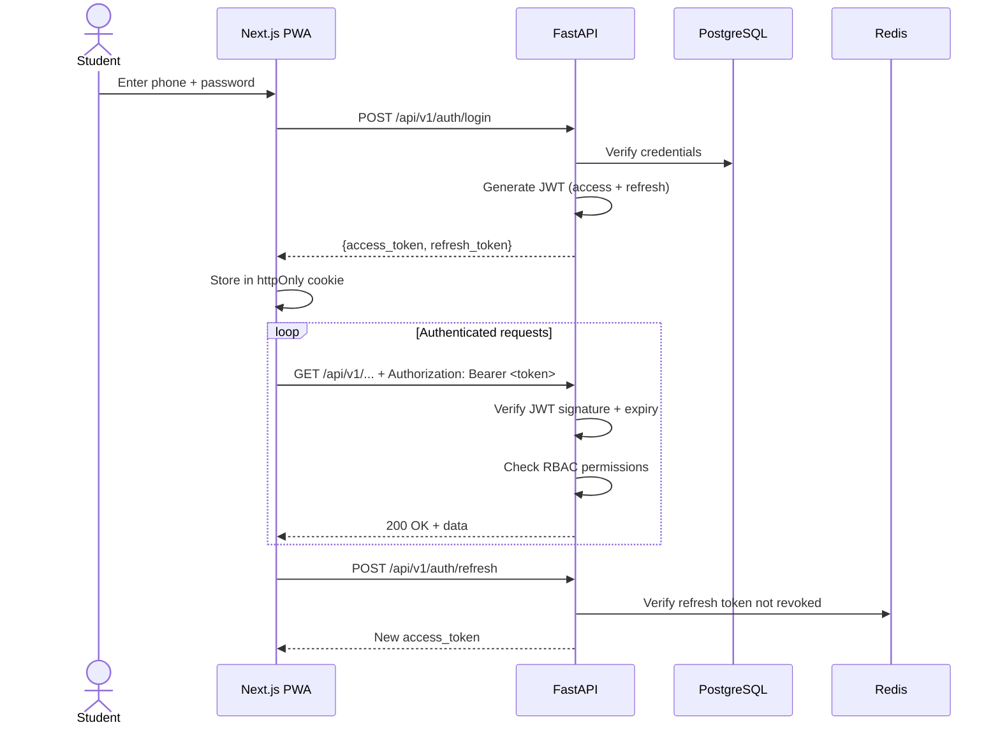

### Role-Based Access Control (RBAC)

| Role | Permissions |
|------|------------|
| **student** | Upload materials, view own progress, take quizzes, manage flashcards, make payments |
| **teacher** | All student permissions + view class progress, upload bulk materials |
| **admin** | All permissions + approve/reject content, view analytics, manage users, edit content |

### JWT Token Structure

```json
{
  "sub": "uuid-of-user",
  "role": "student",
  "grade": 7,
  "exp": 1700000000,
  "iat": 1699996400
}
```

- **Access Token**: 15-minute expiry
- **Refresh Token**: 30-day expiry, stored in Redis for revocation

---

## AI Content Generation Pipeline

### Pipeline Architecture

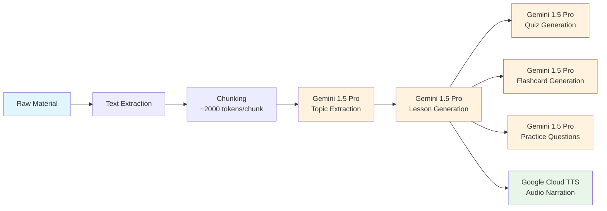

### Gemini Prompt Strategy

Each generation step uses structured prompts with JSON schema enforcement:

1. **Topic Extraction**: Input material text → Output array of topics with subtopics
2. **Lesson Generation**: Input topic + subtopics → Output structured lesson (sections, key points, examples, CBC alignment)
3. **Quiz Generation**: Input lesson content → Output MCQs, short answer, fill-in-the-blank questions with answers
4. **Flashcard Generation**: Input lesson content → Output front/back flashcard pairs
5. **Practice Questions**: Input lesson content → Output worked examples with step-by-step solutions

### Content Validation

- Second Gemini call validates generated content against source material
- Confidence scoring on factual claims
- Admin approval required before content goes live
- Source citations preserved from original material

---

## M-Pesa Payment Flow

### Daraja API Integration

```mermaid
flowchart TD
    A[Student Clicks Subscribe] --> B[Frontend: POST /payments/init]
    B --> C[Backend: Generate STK Push]
    C --> D[Safaricom: Lipa Na M-Pesa Online]
    D --> E[Student: Enter M-Pesa PIN on phone]
    E --> F{Transaction Success?}
    F -->|Yes| G[Safaricom: Callback to /payments/callback]
    G --> H[Backend: Verify + Update DB]
    H --> I[Activate Subscription]
    I --> J[Push notification to student]
    F -->|No| K[Backend: Mark payment failed]
    K --> L[Student: Retry or try again]
    
    G -.->|Callback fails| M[Backend: Poll /payments/query/{id}]
    M --> N{Transaction found?}
    N -->|Yes| H
    N -->|No| O[Log for manual reconciliation]
```

### Payment Plans

| Plan | Price (KES) | Duration | Features |
|------|------------|----------|----------|
| Monthly | 200 | 30 days | Full access to all content |
| Yearly | 700 | 365 days | Full access + priority support |
| Free Trial | 0 | 7 days | Limited content (3 topics per subject) |

---

## Caching Strategy

### Redis Cache Layers

| Cache Key Pattern | TTL | Purpose |
|-------------------|-----|---------|
| `user:{id}:progress` | 5 min | Dashboard progress data |
| `topic:{id}:quiz` | 1 hour | Quiz questions (rarely change) |
| `topic:{id}:flashcards` | 1 hour | Flashcard sets |
| `topic:{id}:lesson` | 1 hour | Lesson content |
| `material:{id}:status` | 30 sec | Processing status polling |
| `rate_limit:{ip}` | 1 min | API rate limiting |
| `session:{refresh_token}` | 30 days | Refresh token storage |

### Cache Invalidation

- **Write-through**: Lesson/quiz updates invalidate related cache keys
- **TTL-based**: All caches have explicit TTL
- **Event-driven**: Material processing completion triggers cache refresh

---

## Offline Architecture (PWA + Service Worker)

### Service Worker Strategy

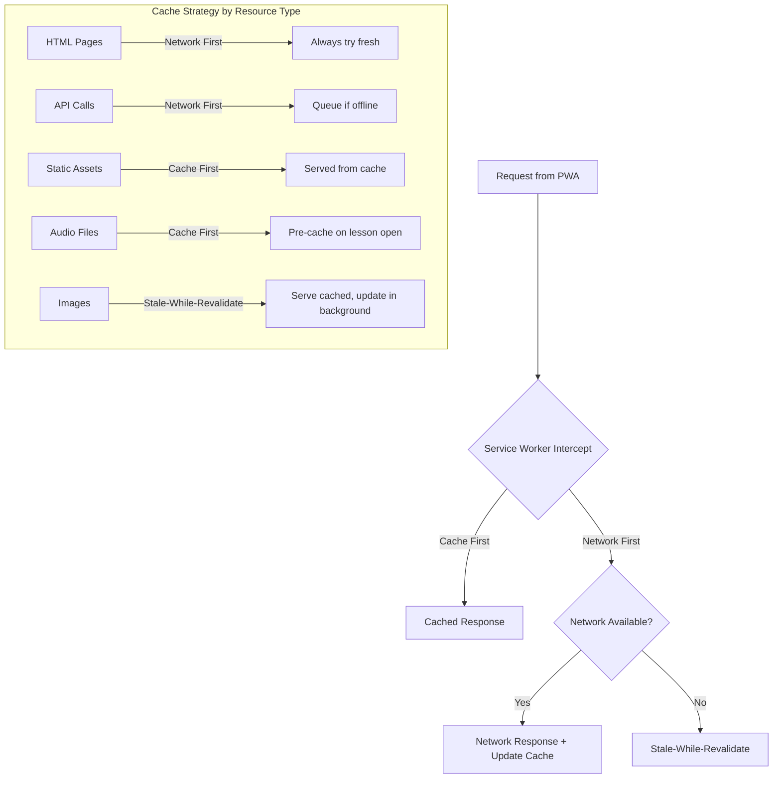

### Offline Capabilities

| Feature | Offline Support | Notes |
|---------|----------------|-------|
| View lessons | Yes | Cached on first visit |
| Take quizzes | Yes | Questions cached, answers queued |
| Review flashcards | Yes | SM-2 state stored locally |
| Listen to audio | Yes | Audio files pre-cached |
| Upload materials | No | Requires network |
| Make payments | No | Requires network |
| View dashboard | Yes | Last-synced data |
| Submit progress | Queued | Syncs when online |

### Sync Strategy

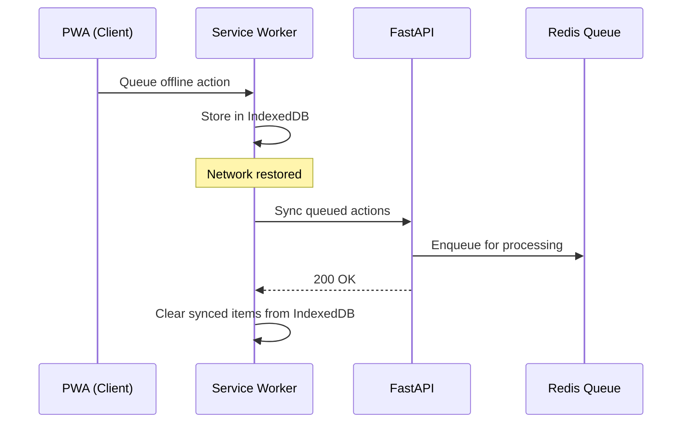

### IndexedDB Schema (Client-Side)

| Store | Purpose | Sync Direction |
|-------|---------|---------------|
| `progress_queue` | Queued quiz answers, progress updates | Client → Server |
| `cached_lessons` | Offline lesson content | Server → Client |
| `cached_flashcards` | Offline flashcard data | Server → Client |
| `user_preferences` | UI settings, theme | Local only |
| `sync_metadata` | Last sync timestamps | Local only |

---

## Infrastructure Diagram

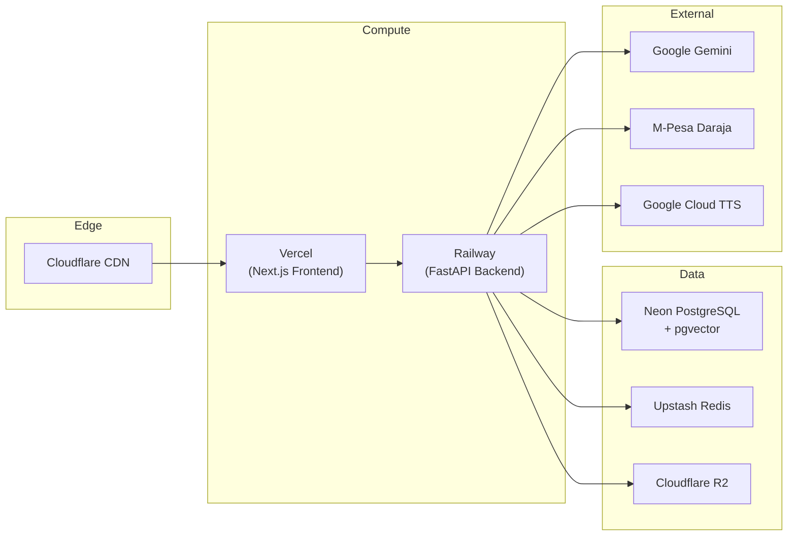

---

## Security Considerations

- **Transport**: HTTPS everywhere (TLS 1.3)
- **Authentication**: JWT with short-lived access tokens (15 min)
- **Authorization**: RBAC enforced at API gateway level
- **Data at Rest**: PostgreSQL encryption, R2 server-side encryption
- **Input Validation**: Pydantic models on all endpoints
- **Rate Limiting**: 100 req/min per IP, 10 req/min for auth endpoints
- **CORS**: Strict origin whitelist
- **Headers**: CSP, X-Frame-Options, HSTS
- **Secrets**: Environment variables, never in code
- **Logging**: No PII in logs, structured JSON logging

---

## Monitoring & Observability

| Layer | Tool | Metrics |
|-------|------|---------|
| Frontend | Vercel Analytics | Core Web Vitals, page load |
| Backend | Sentry | Error tracking, performance |
| Database | Neon Dashboard | Connection count, query time |
| Redis | Upstash Dashboard | Memory, ops/sec |
| API | Custom metrics | Request latency, error rates |
| Business | Admin dashboard | Users, completions, revenue |

---

## Scalability Notes

- **Horizontal**: Railway auto-scales backend instances
- **Database**: Neon branching for development, connection pooling via PgBouncer
- **Cache**: Upstash auto-scales with request volume
- **Storage**: R2 has no egress fees, scales infinitely
- **AI**: Gemini API has generous quotas; batch processing during off-peak hours
- **Queue**: Redis-backed job queue handles concurrent generation requests
